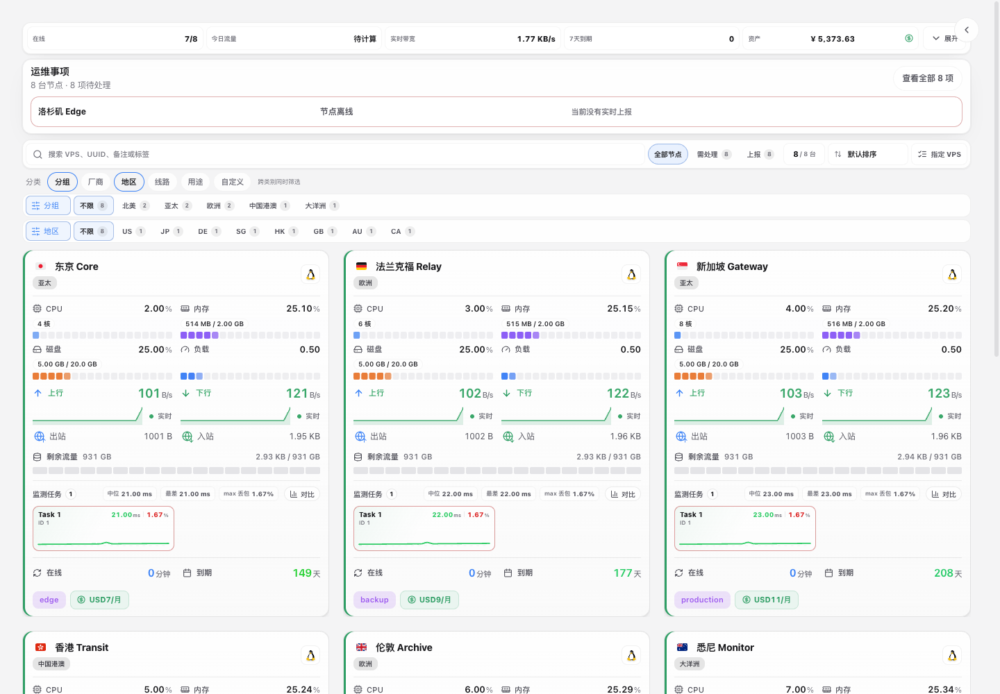
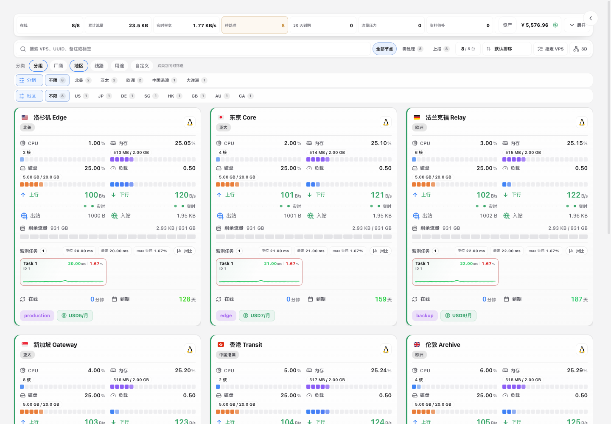
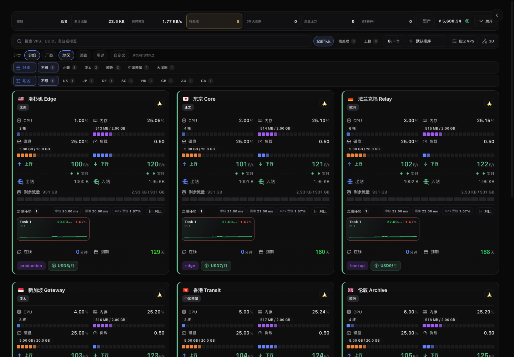
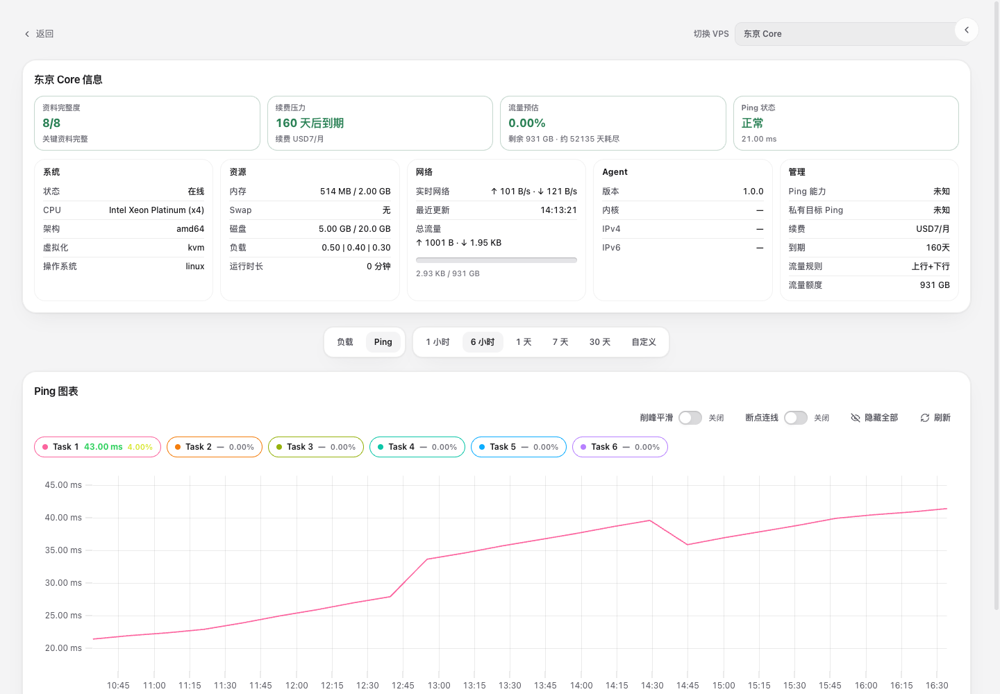
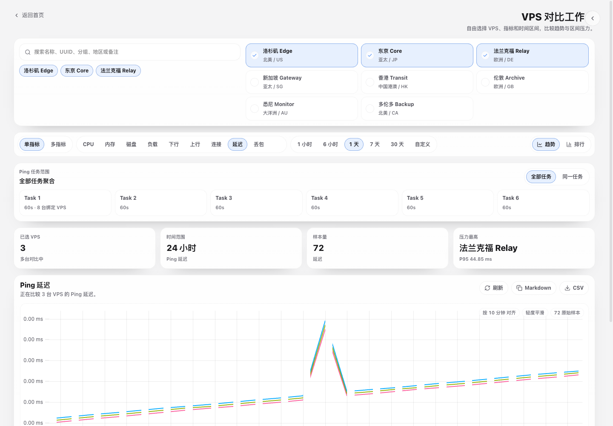
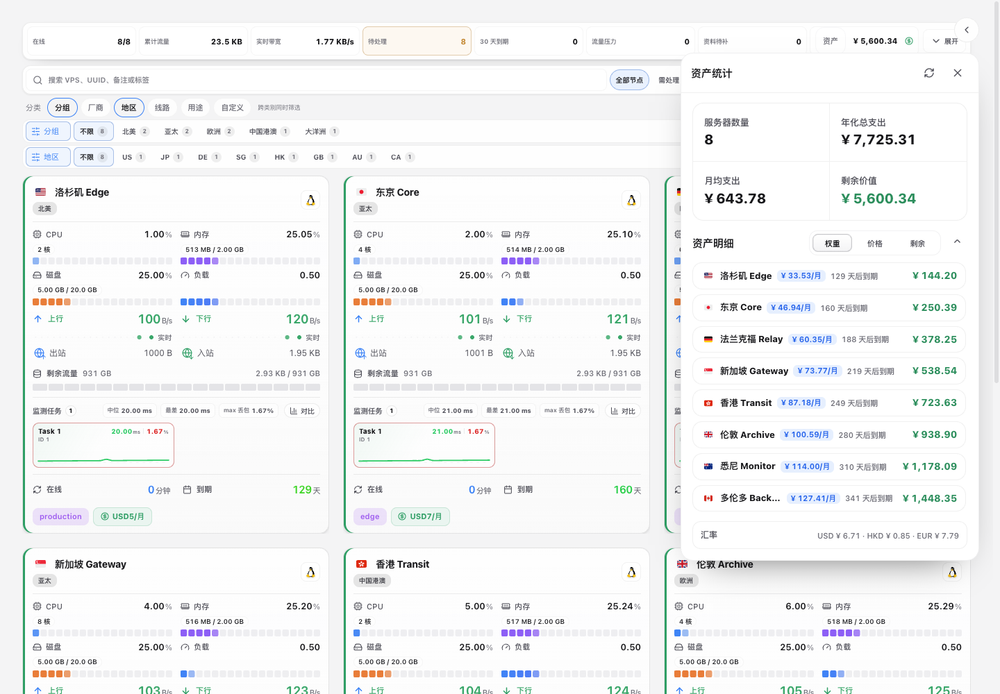
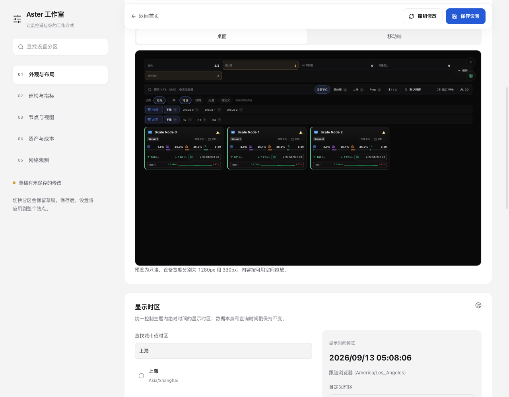
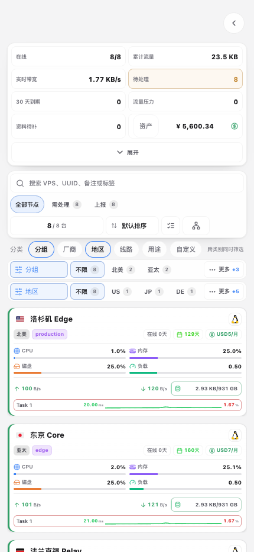
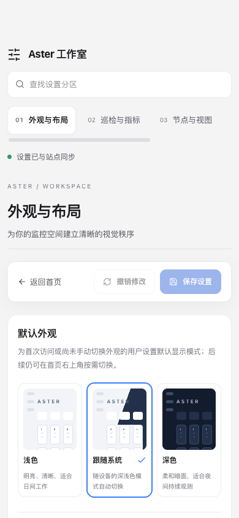

# Aster · 星枢

面向 Komari 的服务器监控与资产管理主题，由 shaolonger 独立维护。围绕节点总览、VPS 工作台、多目标 Ping 分析和节点比较，重构界面与交互体验。

## 安装与迁移

- 主题仓库：<https://github.com/shaolonger/Komari-Theme-Aster>
- 在 [Releases](https://github.com/shaolonger/Komari-Theme-Aster/releases/latest) 下载 `Komari-Theme-Aster-v*.zip`，通过 Komari 后台上传并启用。
- 从旧主题迁移时，先记录原主题配置，再添加新仓库或上传 Aster 包；后端可能按主题名称分别存储配置，启用后请检查并恢复设置。
- Aster 延续仓库已有的语义化版本序列。工作台展开偏好使用 Aster 独立存储。

## 后端兼容性

主题会自动识别官方 Komari 与既有二次修改版的 RPC 能力，并将两者归一化为同一套页面数据模型。有关适配范围、迁移注意事项、指标与 Ping 的处理方式，以及完整的验证命令，请见 [兼容性说明](COMPATIBILITY.md)。

后台主题菜单可直达 Aster 工作室；Komari 官方文档注明 `redirect` 配置入口需要服务端高于 1.2.0。较旧版本仍可从首页右上角打开工作室。

## 网络观测

Aster 可通过伴生 Komari 插件定时检查 HTTPS、NextTrace 路径、三网回程、国际互联和吞吐量。该功能使用 Komari 插件与 Agent 远程任务接口，不需要修改或重新编译 Komari 源码；需要安装网络观测插件、在目标节点部署探测脚本并启用 Agent 远程执行。安装步骤、权限说明、工具依赖和 TcpQuality 第三方连接说明见 [网络观测插件文档](network-observatory/README.md)。HTTPS、NextTrace 与自建 iperf3 可完全使用免费软件和自有端点；第三方测试端点可能看到探测节点的公网 IP，运营者仍需承担自有服务器及网络流量成本。

## 效果预览

以下图片由当前仓库代码在官方 Komari 兼容模拟环境中直接运行并截图，展示 Aster 当前界面；演示节点和监控数值均为模拟数据。

  

### 首页总览

首页聚合在线率、流量、带宽、风险、到期和资产数据，并支持搜索、组合筛选、排序、节点选择及多种卡片密度。

  

  

### 实例详情

实例详情集中展示资料完整度、续费压力、流量预估、运行状态，以及可切换时间范围的负载和多任务 Ping 图表。

  

### VPS 对比工作台

可同时选择多台 VPS 和多项指标，对齐时间序列并查看趋势、排名、统计摘要与 Ping 任务范围。

  

### 资产统计

资产面板按月均价格、剩余价值和到期时间汇总节点成本，支持排序和汇率换算。

  

### Aster 工作室

Aster 工作室按外观、巡检、节点、资产和网络组织配置，支持分区搜索、草稿撤销、节点选择和批量任务绑定。保存失败时保留草稿。

  

### 移动端

移动端采用紧凑卡片和折叠总览，在窄屏中保留筛选、资产、实时指标及 Ping 趋势。

  
  

## 来源与致谢

本项目最初基于 [shanyang242/Komari-Theme-LuminaPlus](https://github.com/shanyang242/Komari-Theme-LuminaPlus) 修改，现以 Aster 品牌持续开发。感谢 shark、shanyang 及原项目贡献者的工作；更名保留原有贡献历史与来源说明。

特别感谢 [stqfdyr/komari-theme-Lumina](https://github.com/stqfdyr/komari-theme-Lumina)。

也感谢 Komari 官方主题、Mochi、PurCarte 等主题项目为 Komari 生态提供的设计和实现思路。

## 参考

- [Komari](https://github.com/komari-monitor/komari)
- [komari-theme-Lumina](https://github.com/stqfdyr/komari-theme-Lumina)
- [Komari 主题开发文档](https://komari-document.pages.dev/)

## Star History

<a href="https://www.star-history.com/?repos=shaolonger%2FKomari-Theme-Aster&type=timeline&legend=bottom-right">
 <picture>
   <source media="(prefers-color-scheme: dark)" srcset="https://api.star-history.com/chart?repos=shaolonger/Komari-Theme-Aster&type=timeline&theme=dark&legend=bottom-right" />
   <source media="(prefers-color-scheme: light)" srcset="https://api.star-history.com/chart?repos=shaolonger/Komari-Theme-Aster&type=timeline&legend=bottom-right" />
   
 </picture>
</a>
